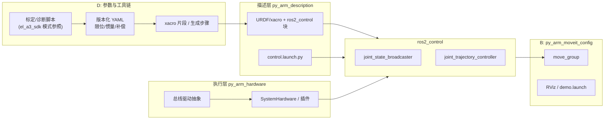

# Plan Record

## 输入

- **task_id**：`20260509-custom-arm-software-framework`
- **任务描述**：自有机械臂硬件已就绪；以 `src/reference/EDULITE_A3/el_a3_ros` 为参考，搭建 ROS2 软件框架并按 **A→B 主顺序、D 横切** 落地（A=真机控制闭环，B=仿真/MoveIt，D=参数与工具链同源）。不包含遥操作主线 C。
- **约束条件**：
  - ROS 2 **Humble**；与参考栈同类的多包 colcon 布局。
  - 自有电机/总线可能与 A3（CAN + Robstride 族）不一致 — **hardware 层允许重写**，描述/控制器模式可继承。
  - 本仓：`readme.md` 定义 Docker/镜像流程；产品 ROS 包建议新建于 `src/project/<ros_ws>/`（名在子任务 1 冻结）。
- **上下文路径**：
  - 参考：`src/reference/EDULITE_A3/el_a3_ros/`（`el_a3_description`、`el_a3_hardware`、`el_a3_moveit_config`、`el_a3_teleop`、根级 `scripts/`）。
  - SDK/标定参照：`src/reference/EDULITE_A3/el_a3_sdk/`。
  - 任务卡：`agent_workspace/tasks/20260509-custom-arm-software-framework/00-task-card.md`。

---

## 任务理解

- **目标**：形成可演进的 **ros2_control 优先** 软件骨架：先能在 **实机** 上稳定读出关节状态并执行最小轨迹（A），再补齐 **mock + MoveIt** 的规划—执行闭环（B）；全程为 **标定/诊断产出 → 版本化 URDF·YAML 参数** 预留管道（D），避免与 `el_a3_sdk` 式工作流割裂。
- **边界**：首版不交付量产认证、不拔高为完整遥操作（`el_a3_teleop` 不对标纳入）；不强制一次接满 SDK 全部 GUI，但 **D 最小契约**（见下）必须可执行、可复现。
- **与验收标准对齐**：
  - **AC-01**：下文分层图、建议目录、**10 条**子任务（>8）含依赖与 D 标记。
  - **AC-02**：参考包映射表 + MoveIt/遥操作纳入说明。
  - **AC-03**：环境矩阵 + **A / B** 两条最小成功路径（命令级草案）。
  - **AC-04**：仍待确认项收敛为 **Plan 默认假设**；`owner` 仍为空，需负责人补。

### 仍待确认项 → Plan 默认假设

| 待确认项 | Plan 默认（可被负责人推翻） |
|----------|-----------------------------|
| DOF / 总线 / 驱动是否与 A3 同类 | **不同类**：hardware 以 **新写驱动 + 保留 ros2_control 插件边界** 规划；接口形状参考 `el_a3_hardware`，实现不假设可拷贝编译通过。 |
| URDF 与 CAD 同步 | **混合**：链长、关节轴、限位以 **xacro 参数化** 为主；外观 mesh 可由 CAD 导出，**非阻塞** A。 |
| 运动学求解与规划后端 | **首试** `pick_ik` + OMPL（与参考一致）；若 DOF/奇异结构差异大，在子任务 9 中触发「替换 IK 配置」分支并记录。 |
| 多臂 / 工具 | **首版单臂**；在 topic、frame、`robot_description` 命名空间预留前缀，避免将来改名风暴。 |

---

## 系统分层与包布局（架构结论摘要）

**权威文档承诺**：首版 **control + description 包可 `colcon build` 成功之前**，创建并登记 `doc/arm_ros_stack/architecture.md`（分层、冻结点、与本文「映射表」一致；修订记录随结构变更更新）。**冲突时以该文件最新版为准**，本 plan 保留任务期论证与快照。

### 控制与规划数据流（逻辑）



### 建议工作空间目录（相对 `py_arm` 仓库）

```text
src/project/py_arm_ros/              # colcon 根（名称可调整，一经写入 architecture.md 即冻结）
├── doc/                             # 或仓库级 doc/arm_ros_stack/ 引用此 workspace
├── py_arm_description/
│   ├── urdf/  config/  launch/
├── py_arm_hardware/
│   ├── src/  include/  (pluginlib 导出)
├── py_arm_moveit_config/
│   ├── config/  launch/
└── README.md                        # 最小构建与 launch 索引
```

包名前缀 **`py_arm_*`** 为本文建议；若品牌命名确定，在子任务 1 一次性替换并在 `architecture.md` 记录。

### 与 `el_a3_ros` 映射（AC-02）

| 参考包 | 拟定自有包 | 策略 | 首版范围 |
|--------|------------|------|----------|
| `el_a3_description` | `py_arm_description` | **新建**：复制 xacro/ros2_control **结构**，替换关节链、硬件插件名与参数 | **A+B**：control launch + 为 MoveIt 预留 |
| `el_a3_hardware` | `py_arm_hardware` | **新建为主**：接口形态参考 `RsA3HardwareInterface`；**总线实现重写** | **A 核心** |
| `el_a3_moveit_config` | `py_arm_moveit_config` | **新建**：SRDF/kinematics/OMPL 模板自参考改编 | **B**（A 完成后作为验收主序的第二里程碑） |
| `el_a3_teleop` | — | **不纳入首版** | Backlog；若要加，另起任务避免冲淡 A/B |

**MoveIt2**：纳入（路线 B）。**遥操作**：不纳入（路线 C 已排除）。

---

## 基础件选型（ROS 栈）

| 层级 | 选型 | 角色 | 备选 / 不选理由 |
|------|------|------|-----------------|
| 发行版 | ROS 2 Humble | 与参考、`readme` 容器一致 | Jazzy：与参考分叉大，本阶段不采用 |
| 控制框架 | ros2_control | 标准硬件生命周期与控制器 | 自研周期与生态成本高 |
| 规划 | MoveIt2 | B 阶段任务与算法验证 | MoveIt 仅 B：不阻塞 A |
| IK（默认） | pick_ik（若适用） | 与参考配置延续 | 若失败率高 → trac_ik / bio_ik 在子任务 9 评估 |
| 中间件配置 | Fast DDS + 可选 XML | 参考 `fastrtps_no_shm.xml` 模式 | — |
| 构建 | colcon + ament_cmake / ament_python | 与参考一致 | — |

**版本策略**：以容器内 `/opt/ros/humble` 为准；本 workspace **不 pin 第三方 ROS 包版本** 于首版，但在 `architecture.md` 记录验证过的镜像 digest 或 Dockerfile 标签。

---

## 任务拆解（可指派子任务）

约定列：**ID | 名称 | 输入 | 输出 | 依赖 | D？**（D=须产出或更新参数/工具链挂钩物）

| ID | 名称 | 输入 | 输出 | 依赖 | D？ |
|----|------|------|------|------|-----|
| T1 | **工作空间与命名冻结** | 仓库惯例、任务卡 | `src/project/...` 路径、包名前缀、`architecture.md` 初稿与修订记录 | — | ✓（目录与契约） |
| T2 | **py_arm_description：链路 xacro** | CAD/测量草图或现有 DH、关节数 | 可加载的 `robot_description`、`ros2_control` xacro 宏、mesh 占位 | T1 | ✓（宏参数表） |
| T3 | **D 最小契约：参数包** | T2 关节列表 | `config/joint_limits.yaml`、`config/inertia_params.yaml`（可先占位）、**生成或合并流程说明**（脚本或 Makefile 目标） | T2 | ✓ |
| T4 | **py_arm_hardware：插件骨架** | T2 关节名、`hardware_interface` 类型 | 可编译的 `pluginlib` 导出、read/write 桩、**总线抽象接口**（C++ 头文件） | T1,T2 | — |
| T5 | **总线驱动实现** | 硬件协议文档、Linux 设备（SocketCAN 等） | 真实读写的最低实现 + 单元/台架自测记录 | T4 | ✓（诊断日志格式可与 SDK 对齐） |
| T6 | **controllers + control launch（A）** | T4,T5、参考 `el_a3_controllers.yaml` | `*.yaml` + `*_control.launch.py`，`joint_state_broadcaster` + 轨迹控制器 | T4,T5 | ✓（控制器增益与限幅与 YAML 同源） |
| T7 | **里程碑 A 验收** | T6、实机 | 轨迹跟踪成功、**ros2 bag** 最小集、pass/fail 检查表 | T6 | ✓（bag 元数据：参数版本号） |
| T8 | **mock hardware 路径** | T2,T6 | `use_mock_hardware`/参考等价开关、无 CAN 启动 control | T6 | — |
| T9 | **py_arm_moveit_config（B）** | T2,T8、SRDF 草案 | `demo.launch.py`、`moveit_controllers.yaml`、kinematics/OMPL | T8 | ✓（规划关节限位读同源 YAML） |
| T10 | **里程碑 B 验收** | T9 | RViz 规划→执行闭环文档化、与 A 的差异说明（sim2real backlog） | T9 | ✓ |

**依赖顺序一览**：T1 → T2 → T3 → T4 → T5 → T6 → T7（A 正门）；并行允许：T3 与 T4 在 T2 后分叉；B 线在 T8 后集中；T9→T10。

---

## 路线建议（候选方案与取舍）

| 路线 | 内容 | 适用 | 主要代价 |
|------|------|------|----------|
| **R1（推荐）** | **结构继承 A3、驱动重写、参数 D 管道首发**：描述与控制 YAML 强参考 `el_a3_*`，hardware 新写；MoveIt 跟 B | 当前已确认 A→B+D、硬件可能与 A3 不同 | 需要严格做 **差异表**，防止复制粘贴残留 frame/关节名 |
| **R2** | **最小 fork**：在 `el_a3_ros` 上全局改名与硬改驱动 | 极同类硬件、极短窗口 | 与上游合并困难；**不推荐** 除非命题 2 确认为「同类电机+协议」 |
| **R3** | **仅 ros2_control + 自建消息、暂不 MoveIt** | 团队无运动规划需求 | 与已选 **B** 冲突；仅作风险回退（缩短 B） |

**推荐**：**R1**。理由：满足 A 先实机、B 再规划；D 可在 T3/T6/T7/T9 嵌入；避免 R2 的供应链锁定；R3 仅在 MoveIt 集成严重阻塞时作 scoped 降级（记录于 `03-review.md`）。

---

## 环境与可重复性（AC-03）

| 维度 | 说明 |
|------|------|
| 构建主机 | `readme.md`：**amd64** 仿真/开发容器；**arm64** 目标板按 `docker/run_arm64_runtime_container` 等脚本 |
| ROS 环境 | `source /opt/ros/humble/setup.bash` → `colcon build --symlink-install` → `source install/setup.bash` |
| 验证责任 | 至少在 **一种** 环境下完成 T7/T10；跨架构差异写入 `02-implement.md` |

### 最小成功路径（命令级草案，实现阶段可按实际 launch 名微调）

**A（实机，占位 `<args>`）**：

```bash
cd /work/py_arm/src/project/py_arm_ros   # 容器内挂载路径以实际为准
source /opt/ros/humble/setup.bash
colcon build --symlink-install --packages-up-to py_arm_hardware py_arm_description
source install/setup.bash
# 配置总线（示例：CAN）
# ros2 launch py_arm_description py_arm_control.launch.py can_interface:=can0 ...
```

**验收**：`joint_states` 发布频率与轨迹跟踪误差阈值在 T7 检查表中定义。

**B（mock / MoveIt）**：

```bash
colcon build --symlink-install --packages-up-to py_arm_moveit_config
source install/setup.bash
# ros2 launch py_arm_moveit_config demo.launch.py
```

**验收**：RViz 中交互规划执行无致命异常，`move_group` 与 `ros2_control` 桥接状态与参考 `demo.launch.py` 行为同类。

---

## 风险与缓解

| 风险 | 影响 | 缓解 |
|------|------|------|
| 总线/电机协议与 A3 差异大 | A 延期集中在 T5 | T4 先 **抽象 Bus API**；T5 可先用 **回环桩** + 单关节台架；差异表驱动接口 |
| URDF 与实测不符 | 控制振荡、规划碰撞失真 | D：T3 限位/惯量迭代；T7 bag + 标定脚本挂钩 |
| MoveIt 配置与真机动态不一致 | B 通过、A 失败 | **验收顺序严格 A 先于 B**；B 文档写清 sim2real 差距 |
| 人手不足并行 B | 抢资源拖累 A | B 仅允许在 T2/T8 就绪后投入；T9 排期在 T7 之后 |
| `owner` 缺失 | 决策延迟 | 补全 `00-task-card.md` owner；关键技术判断双人复核 |

**执行节奏**：优先 **T1+T2+T4** 合并为首个可 `colcon build` PR，再合 T5；每周核对一次 D 产物与 `py_arm_description`/controllers 是否仍单一真源。

---

## 下一步

1. 负责人 **审阅本 plan**，推翻/采纳「Plan 默认假设」表。
2. 执行工作流 **`confirm-plan`**（或等价评审）：通过后任务卡 `status` → `planned`，`next_action` → `implement-task` 从 **T1** 开始。
3. 创建 **`doc/arm_ros_stack/architecture.md`** 并与 T1 同 PR 或紧随其后，避免实现与文档分叉。
